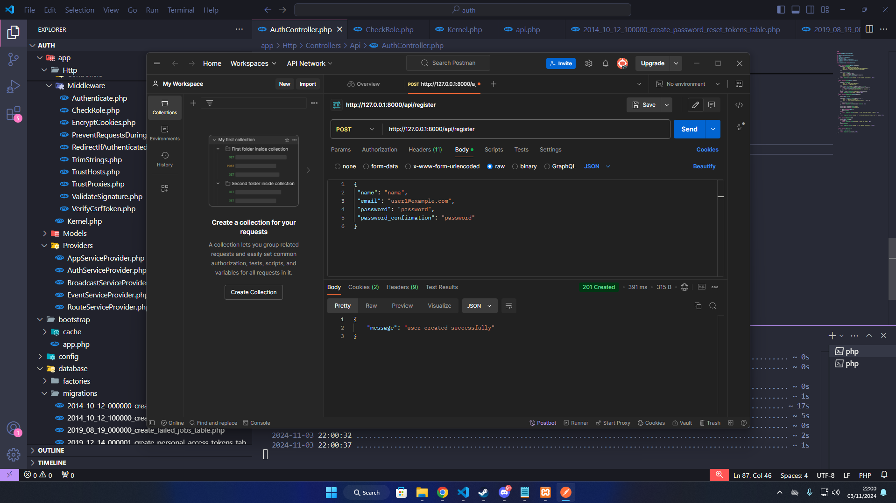
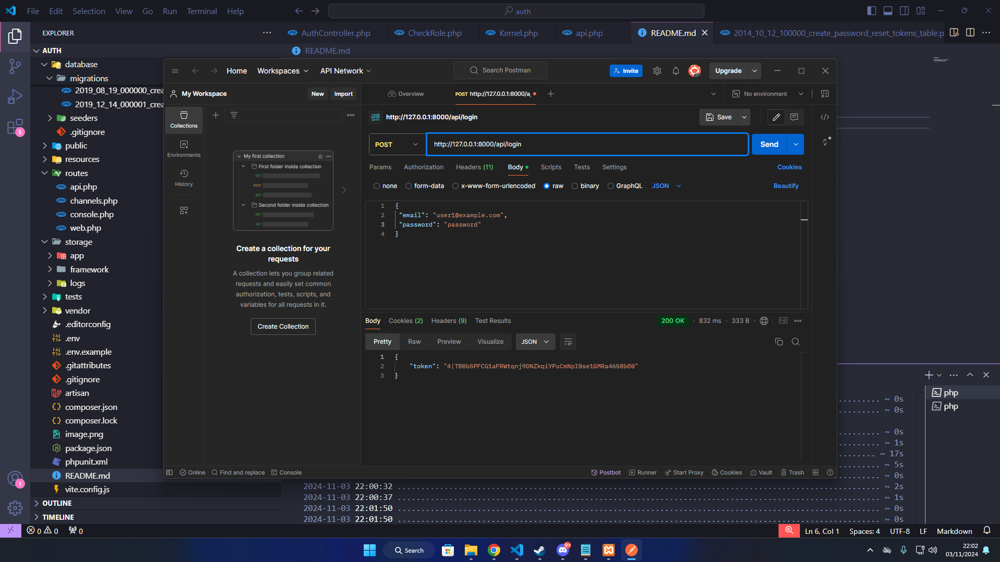

Praktikum

1. Mencoba Register di postman

2. Login: jika berhasil akan mendapat token

3. Update nama email dan password:

Pertanyaan Evaluasi

1. Apa yang dimaksud dengan Laravel Sanctum?
paket otentikasi sederhana yang disediakan oleh Laravel untuk mengamankan aplikasi dengan otentikasi berbasis token.
2.Bagaimana cara mengelola token autentikasi di Laravel?
- Instal Sanctum dan jalankan migrasi.
- Membauat token saat login dengan createToken.
- Menggunakan token sebagai Bearer Token di header permintaan API.
- Lindungi rute dengan middleware auth:sanctum.
- Hapus token saat logout dengan tokens()->delete() atau currentAccessToken()->delete().
3.Sebutkan langkah-langkah untuk menambahkan otorisasi berbasis peran dalam API!
    Menambahkan kolom role di tabel users untuk menyimpan
    Menambah role ke attribut fillable di model user
    Mendaftarkan Middleware di kernel
    Menggunakan token pengguna dengan peran yang sesuai untuk mengakses endpoint terbatas.

Tugas Praktikum

1. Mengubah role dari user menjadi admin

Tampilan ketika login berhasil (admin)

2. Methode Delete data (admin)

3. Mengambil Daftar Semua Pengguna

